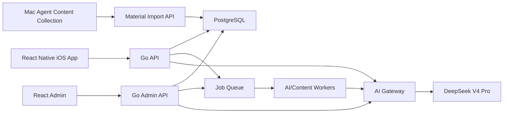

# 年糕技术架构设计文档 v4.5

日期：2026-05-24
状态：一致性修订后的架构基准
目标：支撑生产级 iOS App 和管理后台，第一阶段面向万级用户规模设计

已校验文档：

- `docs/product/niangao-user-prd-v4.md`
- `docs/product/niangao-admin-prd-v4.md`
- `docs/product/niangao-gap-analysis-v4.md`
- `docs/product-decisions-2026-05-24.md`

## 0. 校验结论

本技术设计已按拆分后的用户产品 PRD 和管理后台 PRD v4.5 功能实现方案重新校验，结论如下：

- 用户侧「看看 / 聊聊 / 记下 / 我的」都可以落在现有 monorepo 的 mobile + Go API + PostgreSQL 架构上，但需要重构经验模型、聊聊议题和 AI Gateway。
- 管理后台六个一级模块都应由 Go Admin API 提供统一接口，不再把旧「审核队列」作为中心模块。
- 平台内容生产必须走异步队列，不能占用用户实时链路。
- 用户私密经验、私密议题和聊天进入后台，但必须通过默认折叠、权限控制和审计日志约束。
- DeepSeek 是年糕全部 AI 功能的执行方，但所有功能必须通过 function_type、key alias、限流、预算和调用日志统一治理。
- 旧实现可以迁移交互和基础组件，但旧字段语义如 `review_status`、`like_count`、`source_type` 不能继续混用到新版模型中。
- 推荐、搜索、记下、聊聊、内容生产、经验分层和 AI 功能必须以 PRD v4.5 中的功能实现方案为准；技术架构只承接这些方案，不自行发明产品逻辑。

## 1. 架构目标

新版年糕需要支撑四类核心能力：

1. 用户产品：看看、聊聊、记下、我的。
2. 平台精选：素材采集、DeepSeek 处理、批次生产、质量分层、推荐和 AI 引用。
3. 管理后台：运营总览、数据看板、经验管理、内容生产、用户与反馈、AI 与系统。
4. AI 基础设施：DeepSeek 功能拆分、key alias、限流、队列、成本统计和失败恢复。

架构原则：

- 用户实时链路优先。
- 内容生产低优先级、可暂停、可恢复。
- 经验主模型统一，但公共运营和私密管理分区。
- AI 调用全量记录事实日志，聚合统计另建。
- 新设计优先，旧实现能用则迁移，不能用则删除。

## 2. 当前工程结构

当前 monorepo 结构：

- `mobile/`：React Native App。
- `backend/`：Go API 服务。
- `admin/`：React + Vite 管理后台。
- `ai-service/`：Python FastAPI AI 服务。
- `docs/`：历史产品和实现文档。
- `designs/`、`sketches/`：历史视觉稿。

目标结构保持 monorepo，不拆仓库。

## 3. 目标系统架构



### 3.1 Go API

Go 后端负责：

- 用户认证。
- 经验 CRUD。
- 看看推荐和搜索。
- 收藏、有启发、事件记录。
- 聊聊议题、消息、引用记录。
- 管理后台 API。
- AI Gateway。
- 异步任务调度。
- 数据权限和审计。

不建议把用户产品核心业务放到 Python AI 服务里。AI 服务只做模型调用和文本处理，业务状态由 Go 后端掌控。

### 3.2 Python AI 服务

第一阶段可以保留 Python AI 服务，但定位收窄：

- 作为 DeepSeek 调用适配层。
- 承载 prompt 模板、格式化、解析和少量模型后处理。
- Prompt、payload、输出 schema、阶段变体和 eval 必须按 `docs/product/niangao-ai-functional-prompt-spec-v4.md` 和 `docs/product/niangao-ai-prompt-production-spec-v4.md` 实现；前者定义功能链路，后者定义生产级 prompt 内容和上线门槛。
- 不持久化业务数据。
- 不决定经验可见性和生命周期。

中期可以把 AI Gateway 合并到 Go，或继续保留 Python 服务作为 AI Worker，取决于稳定性和部署复杂度。

### 3.3 PostgreSQL

PostgreSQL 是业务主库。

必须支持：

- 经验主表。
- 用户资料。
- 收藏和有启发。
- 行为事件。
- 聊聊议题和消息。
- 平台素材、候选、批次。
- AI 调用日志。
- 后台审计。

后续如需要语义检索，可使用 pgvector 或外部向量服务。第一阶段可以先用关键词、领域、子领域、收藏时间和规则召回，再逐步接入向量。

### 3.4 Job Queue

需要引入明确的异步任务队列。可选实现：

- PostgreSQL backed queue。
- Redis queue。
- 云厂商任务队列。

第一阶段推荐 PostgreSQL backed queue，减少基础设施数量，但表结构要预留迁移到 Redis / MQ 的可能。

队列分层：

- user_realtime：用户实时请求，不走低优先队列。
- user_normal：用户主动操作的轻 AI 任务。
- user_background：用户后台任务，如议题摘要。
- content_low：平台经验生产。
- admin_manual：后台手动任务。

## 4. 核心数据模型

详见 `docs/product/niangao-user-prd-v4.md`、`docs/product/niangao-admin-prd-v4.md` 和 `docs/product-decisions-2026-05-24.md`。

第一阶段目标表：

- admin_users。
- admin_sessions。
- admin_audit_logs。
- admin_private_access_logs。
- admin_security_events。
- users。
- feedback。
- user_profiles。
- user_memory_profiles。
- user_preference_profiles。
- experiences。
- experience_public_snapshots。
- experience_interpretations。
- experience_metrics。
- experience_events。
- experience_collections。
- experience_inspirations。
- creators。
- source_materials。
- production_batches。
- processing_units。
- production_batch_reports。
- content_weekly_reports。
- candidate_experiences。
- recommendation_sessions。
- search_sessions。
- chat_temp_sessions。
- chat_topics。
- chat_messages。
- chat_citations。
- chat_session_feedback。
- ai_key_aliases。
- ai_function_configs。
- ai_prompt_registry。
- ai_call_logs。
- ai_jobs。
- ai_rate_limit_counters。
- ai_budget_policies。
- ai_usage_daily_stats。
- source_pools。
- collection_targets。
- source_exclusion_items。
- user_daily_stats。
- content_daily_stats。
- interaction_daily_stats。
- note_daily_stats。

### 4.1 实现边界矩阵

| PRD 能力 | 前端承载 | 后端承载 | 数据承载 | AI/队列 |
| --- | --- | --- | --- | --- |
| 看看推荐 | mobile | Go API `/feed/recommend` | experiences、experience_metrics、experience_events | recommendation_ai 可选降级 |
| 看看收藏 | mobile | Go API `/feed/collections` | experience_collections | 无 |
| 看看我的 | mobile | Go API `/feed/mine` | experiences | 无 |
| 搜索 | mobile | Go API `/search/experiences` | experiences、creators、FTS/索引 | 后续 embedding/rerank |
| 记下 | mobile | Go API `/experiences` | experiences | moderation / experience_classify 异步 |
| 帮我整理 | mobile | Go API + AI Gateway | ai_call_logs | experience_rewrite |
| 聊聊 | mobile | Go API `/chat/*` | chat_topics、chat_messages、chat_citations | chat、chat_summary、chat_topic_classify |
| 我的统计 | mobile | Go API `/me/stats/*` | experiences、collections、chat、daily stats | 无 |
| 运营总览 | admin | Admin API `/overview` | daily stats、jobs、ai logs | 无 |
| 数据看板 | admin | Admin API `/analytics/*` | user/feed/chat/note/content/ai daily stats、events | 无 |
| 经验管理 | admin | Admin API `/experiences/*` | experiences 全域 | interpretation/classification 可异步 |
| 内容生产 | admin | Admin API `/source-materials/*`、`/production-batches/*` | source_materials、batches、candidates | content_low 队列 |
| 用户与反馈 | admin | Admin API `/users/*`、`/feedback/*` | users、feedback、private audit | 无 |
| AI 与系统 | admin | Admin API `/ai/*` | ai_*、admin_audit_logs | 队列控制 |

边界要求：

- mobile 不直接调用 Python AI 服务。
- admin 不直接访问数据库。
- Python AI 服务不持久化业务状态。
- 所有 DeepSeek 调用都必须经过 AI Gateway。
- 所有私密内容查看都必须经过 Admin API 审计。

## 5. 经验域设计

### 5.1 experiences

`experiences` 是统一经验主表，承载：

- 平台精选。
- 用户公开原创。
- 用户私密原创。

关键字段：

- experience_type。
- visibility。
- lifecycle_status。
- owner_user_id。
- creator_id。
- creator_display_name。
- source_scene。
- domain。
- sub_domain。
- topic。
- ai_quality_score。
- quality_score。
- quality_tier。
- source_reliability。
- recommendation_status。
- ai_citable。
- interpretation_status。
- source_material_id。
- production_batch_id。
- source_chat_topic_id。
- source_chat_message_id。
- source_chat_message_snapshot。

领域词表：

- domain 固定为意义、认知、工作、关系、生活、生命。
- sub_domain 必须属于对应 domain：意义包含幸福、自我、情绪、使命、归属、信仰；认知包含学习、思维、信息、工具、创造、表达；工作包含求职、升职、创业、沟通、管理、效率；关系包含夫妻、恋人、朋友、亲子、父母、兄妹；生活包含宠物、旅行、衣着、养护、购物、娱乐；生命包含健康、居住、出行、饮食、运动。
- 用户发布时 domain、sub_domain、topic 可为空；AI 分类、后台编辑和平台精选入库必须校验 domain / sub_domain 合法关系。

分发资格不变量：

- quality_tier 是质量层级事实源。
- recommendation_status 是推荐分发开关，默认由 quality_tier 生成，可人工覆盖。
- recommendation_status 取值为 eligible / ineligible / suppressed。
- ai_citable 是公共 AI 引用开关，默认由 quality_tier 生成，可人工覆盖。
- visibility != public 或 lifecycle_status != active 时，推荐查询必须视为 recommendation_status=ineligible，AI 引用查询必须视为 ai_citable=false。
- quality_tier=public_visible 默认不能进入推荐和公共 AI 引用。
- quality_tier=recommend_candidate 默认可推荐但不可公共 AI 引用。
- quality_tier=ai_citable / high_trust 默认可推荐且可公共 AI 引用。

旧字段迁移建议：

- `source_type` 迁移到 `experience_type`。
- `is_private` 迁移到 `visibility`。
- `status` + `review_status` 迁移到 `lifecycle_status` 和 `quality_tier`。
- `interpretation` 迁移到 `experience_interpretations`。
- `like_count` 迁移语义为 `inspiration_count`。
- `bookmarks` 迁移到 `experience_collections`。

### 5.2 经验事件

所有关键行为写入 `experience_events`：

- expose。
- flip。
- collect。
- uncollect。
- inspire。
- search_click。
- chat_citation_show。
- chat_citation_click。

聚合结果写入 `experience_metrics`，不要直接依赖事件流做列表展示。

事件公共统计规则：

- experience_events 需要保存 source_context，例如 feed、search、chat_citation、mine。
- 来自私密经验的事件只用于用户个人历史和画像，不进入公共 experience_metrics。
- 来自聊聊引用卡的收藏和有启发需要保留 source_context=chat_citation，用于引用策略评估。
- chat_citation_show / chat_citation_click 与 chat_citations 关联，不能只靠前端事件孤立统计。

### 5.3 收藏和有启发

收藏：

- 用户私有资产。
- 下架后关系保留，前台显示不可见。

有启发：

- 对公开经验是公共反馈。
- 对私密经验只作为用户自己的个人历史，不进入公共计数。

## 6. 看看架构

### 6.1 推荐流

推荐接口：

- `GET /api/v1/feed/recommend`

输入：

- user_id。
- cursor。
- limit。

返回：

- experience list。
- cursor。
- interaction state。

推荐逻辑第一阶段：

1. 只召回 public + active + recommendation_status=eligible + quality_tier 至少 recommend_candidate。
2. 过滤用户已删除或不可见内容。
3. 结合领域、子领域、用户收藏、有启发、翻面、搜索点击、AI 引用后反馈。
4. 打散同一创作者和来源。
5. 新用户优先平台精选，逐步混入高质量原创。
6. 快速划走只作为当前候选批次的弱多样性信号，不写入长期负偏好。
7. 随着公开原创的数量、质量和正反馈提高，原创高质量池占比按配置逐步提高。
8. 近期活跃议题的领域、子领域、话题和处境信号可作为弱匹配信号，但不在前台解释。

### 6.2 收藏流

接口：

- `GET /api/v1/feed/collections`

按收藏时间倒序。

如果经验不可见：

- 返回占位对象。
- 前台显示「该经验已不可见」。

### 6.3 我的经验

接口：

- `GET /api/v1/feed/mine`

包含用户自己的公开和私密经验。

全屏卡片：

- 仅私密显示「仅自己可见」。

列表视图：

- 不显示公开/私密标签。

详情/编辑：

- 明确显示状态。
- 公开原创删除前由 API 返回影响摘要，前端优先展示「转为私密」。
- 转私密只更新 visibility，并触发推荐、搜索、AI 引用和贡献反馈聚合失效。

## 7. 搜索架构

搜索接口：

- `GET /api/v1/search/experiences`

支持：

- q。
- domain。
- topic。
- creator。
- cursor。
- limit。

排序：

- query relevance。
- quality tier。
- recommendation score。
- creator/source diversity。

第一阶段可以组合：

- PostgreSQL ILIKE / full text。
- domain / sub_domain。
- creator_display_name。
- topic。

后续接入向量：

- q embedding。
- experience embedding。
- rerank。

## 8. 记下架构

创建接口：

- `POST /api/v1/experiences`

请求：

- content。
- visibility。
- domain 可选。
- sub_domain 可选。
- topic 可选。

响应：

- 已保存经验对象。
- 前台统一显示「已记下」。

首次公开展示名：

- 后端在 visibility=public 时校验用户 display_name。
- 如果 display_name 为空，返回 `display_name_required`，不创建经验。
- 前端弹出轻量展示名设置，成功后用原草稿重试保存。
- visibility=private 不要求 display_name。

处理：

- 保存必须同步快速完成。
- 公开经验进入异步 moderation / experience_classify / quality pipeline。
- 不适合公开时后台自动转 private，用户无感。

帮我整理：

- `POST /api/v1/experiences/rewrite`
- 使用 `experience_rewrite` AI 功能。
- 返回整理文本，用户确认后再保存。

## 9. 聊聊架构

### 9.1 议题

接口：

- `GET /api/v1/chat/recent-topics`
- `GET /api/v1/chat/topics`
- `POST /api/v1/chat/temp-sessions`
- `POST /api/v1/chat/topics`
- `PATCH /api/v1/chat/topics/:id`
- `DELETE /api/v1/chat/topics/:id`

临时会话：

- 进入聊聊时创建 chat_temp_sessions 记录并返回 temp_session_id。
- 首条消息先写入 chat_messages，topic_id 为空，temp_session_id 不为空。
- chat_topic_classify 在临时会话早期、连续两轮围绕同一问题后、用户离开时触发，用于判断是否形成稳定议题。
- 如果用户没有点「换个事聊」，chat_topic_classify 可返回 candidate_existing_topic_id，把临时会话绑定到旧议题。
- 如果用户点过「换个事聊」，临时会话默认保持独立，不自动合并到旧议题。
- AI 判断主题清晰后创建 chat_topic，并把 temp_session_id 下的消息绑定到 topic_id。
- 离开时仍不清晰的临时会话标记 discarded，不进入最近聊过，不用于后续 AI 上下文，明文消息 24 小时内清理。

历史议题：

- 打开历史议题只加载消息和摘要，不触发 AI 自动回复。
- 用户发送新消息后才构建上下文并调用 chat。
- 第一阶段不提供单条消息删除接口；删除操作只作用于整个 chat_topic。

### 9.2 消息

接口：

- `GET /api/v1/chat/topics/:id/messages`
- `POST /api/v1/chat/topics/:id/messages`
- `POST /api/v1/chat/temp-sessions/:id/messages`

发送消息流程：

1. 校验用户和 topic_id 或 temp_session_id 权限。
2. 保存用户消息。
3. 构建上下文：议题摘要、最近消息、相关经验、用户轻资料、后台轻画像。
4. 高风险场景识别。
5. 调用 AI Gateway。
6. 解析自然回复和引用经验。
7. 保存 AI 消息。
8. 保存 chat_citations。
9. 返回回复和引用卡片。

### 9.3 经验检索

召回输入：

- 当前用户消息。
- 议题摘要和最近消息。
- chat_topic_classify 输出的领域、子领域、话题和明确度。
- 规则识别出的情绪状态、关系结构和约束条件。

召回来源：

1. 用户自己的经验。
2. 用户收藏经验。
3. 公共高质量经验。

规则：

- 与当前话题相关才引用。
- 用户收藏经验按相关领域 / 子领域 / 话题优先召回，最多取收藏时间最近的 50 条。
- 用户自己的经验中存在明显相关内容时，最终候选至少保留 1 条。
- 公共经验只从 ai_citable 或 high_trust 池补充，不强制保底。
- 候选经验动态配比，不固定自己的 / 收藏的 / 公共的数量。
- 最终进入 prompt 的经验一般 3-5 条。
- 若无合适经验，不说明没找到。
- 高风险场景只允许 high_trust、ai_citable 且 source_reliability 不为 low 的公共经验进入引用候选。
- 行为提炼类平台经验在高风险场景中只作为背景视角，不作为强建议。

引用记录：

- `chat_citations` 保存 message_id、experience_id、citation_type、shown_at、clicked_at、collected_at、inspired_at。
- citation_type 至少支持 own、favorite、public_featured、public_original。
- 私密经验引用记录不进入公共经验表现聚合。
- chat_session_feedback 是会话级弱信号，只更新引用策略统计，不直接改 experience quality_score。

高风险场景：

- 后端通过规则和 chat_topic_classify 输出识别离职、分手、借钱、医疗、法律、投资、重大关系冲突等场景。
- 高风险标记写入 chat_messages.risk_level 或 message metadata。
- risk_level=high 时，prompt 要求 AI 做条件比较和边界分析，不替用户做决定。
- risk_level=high 时，公共普通原创不作为强建议引用；低来源可靠度经验不展示引用卡。

### 9.4 摘要和长期上下文

议题摘要使用 `chat_summary`。

更新时机：

- 离开聊天。
- App 进入后台。
- 同一前台会话过长且接近上下文 token 上限时做一次后台补偿摘要。

摘要不可见、不可编辑。

## 10. 平台内容生产架构

### 10.1 采集

Mac Agent 负责复杂网页、需要登录的平台、探索性采集。服务器只做公开稳定来源低频抓取。

采集边界：

- Mac Agent 不自动支付、不修改账号资料、不点赞、不评论、不关注、不私信。
- 需要登录或授权的平台，由用户先完成登录；Agent 只做内容查找、读取和保存。
- 服务器定时任务只访问公开、稳定、低风险来源；遇到登录、验证码、付费墙或平台限制时停止并记录失败原因。

导入接口：

- `POST /api/v1/admin/source-materials`
- `POST /api/v1/admin/source-materials/batch-import`

### 10.2 素材库

素材保存策略：

- 公开网页可保存全文。
- 视频/播客可保存转写。
- 书籍和版权敏感内容只保存短片段和位置。
- 登录态内容至少保存链接、创作者、短片段、抓取时间。

关键字段：

- access_type。
- source_derivation_type。
- source_excerpt。
- source_location。
- language。
- transcription_method。
- confidence_score。
- captured_by。
- raw_content_storage_policy。
- source_reliability。
- usable_for_extraction。

长正文、长转写和版权敏感片段默认不在后台列表首包返回，查看时走敏感内容审计。

source_derivation_type：

- direct_quote：创作者原话。
- expressed_principle：创作者明确表达的原则。
- behavior_extraction：从行为叙事中提炼出的原则。
- behavior_extraction 在高风险场景中进入 AI 引用降权，不作为强建议。

### 10.3 生产批次

批次流程：

1. 创建 batch。
2. 选择素材。
3. 拆分 processing_units。
4. translation_normalization。
5. experience_extract。
6. experience_review。
7. 去重。
8. experience_classify。
9. moderation。
10. 计算质量层级和入库置信度。
11. 高置信直接入库。
12. 中置信或边界低置信但仍可能有价值的内容进入 candidate_experiences。
13. experience_interpretation。
14. 更新 metrics 和报告。

冷启动目标：

- 上线前至少 3000 条平台精选经验。
- 按当前 6 个一级领域和 35 个子领域覆盖，不创建新领域。
- 生产批次记录 target_phase、target_domains、target_sub_domains、target_count。
- 后台持续计算冷启动进度、领域缺口、子领域缺口、可 AI 引用数量和解读覆盖率。
- 单个创作者冷启动软上限 50 条，特别高价值可到 100 条；超过 50 条需要在报告中标记，超过 100 条需要人工批准。
- source_reliability 使用 high / medium / low 三档，影响 AI 引用资格、推荐权重、质量分层和复查优先级。

批次规模：

- 前 3 个校准批次每批 100 条素材 / 目标候选。
- 日常补充批 20-50 条。
- 校准稳定后的主题批可扩大到 300 或 500 条，但任务、审核和回滚按 50-100 条处理单元拆分。

批次支持：

- 暂停。
- 继续。
- 取消。
- 重试失败项。
- 导出 Markdown / CSV。
- 整批下架。
- 整批降权。
- 整批复查。

来源治理：

- source_pools 保存来源质量、访问难度、是否适合定期抓取、文本质量、适合领域、质量反馈和排除状态。
- collection_targets 保存优先采集对象和下一步动作。
- source_exclusion_items 保存排除创作者、来源、素材或关键词。
- 命中排除名单的来源不能进入新批次，除非 Owner 解除。
- content_weekly_reports 保存内容生产周报，可导出 Markdown，不写入项目文档。

## 11. 管理后台架构

Admin Web 使用 React + Vite。

目标一级导航：

- 运营总览。
- 数据看板。
- 经验管理。
- 内容生产。
- 用户与反馈。
- AI 与系统。

后台 API 统一走 `/api/v1/admin/*`。

### 11.1 前端模块

建议目录：

- `admin/src/pages/OverviewPage.tsx`
- `admin/src/pages/AnalyticsPage.tsx`
- `admin/src/pages/ExperienceManagementPage.tsx`
- `admin/src/pages/ContentProductionPage.tsx`
- `admin/src/pages/UserFeedbackPage.tsx`
- `admin/src/pages/AISystemPage.tsx`
- `admin/src/components/admin-table/*`
- `admin/src/components/sensitive-content/*`
- `admin/src/api/adminClient.ts`

通用组件：

- AdminTable：列表、筛选、分页、批量选择。
- SensitiveBlock：私密内容折叠、展开审计、权限拦截。
- StatusBadge：统一展示 experience、batch、job、AI 状态。
- BulkActionBar：批量操作确认和结果反馈。
- AuditLogPanel：操作日志展示。

### 11.2 Admin API 模块

Go 后端建议按业务域拆分 handler：

- overview handler。
- analytics handler。
- admin experience handler。
- content production handler。
- admin user handler。
- feedback handler。
- ai system handler。
- audit handler。

所有 handler 共用：

- admin auth middleware。
- role permission middleware。
- audit writer。
- pagination parser。
- filter parser。
- error response helper。

### 11.3 认证和权限

认证：

- 管理员登录。
- JWT。
- role：Owner / Admin / Viewer。

审计：

- 查看私密内容。
- 查看后台轻画像。
- 下架、恢复、删除。
- AI 引用资格调整。
- 质量层级调整。
- 批量操作。

权限矩阵：

| 能力 | Owner | Admin | Viewer |
| --- | --- | --- | --- |
| 查看聚合数据 | 是 | 是 | 是 |
| 查看公开内容 | 是 | 是 | 是 |
| 查看私密明文 | 是 | 是 | 否 |
| 内容写操作 | 是 | 是 | 否 |
| AI 配置 | 是 | 否 | 否 |
| 管理员管理 | 是 | 否 | 否 |
| 批量下架/恢复 | 是 | 是 | 否 |

### 11.4 私密内容访问流程

```text
Admin click reveal
  -> Admin API checks role
  -> Admin API writes admin_private_access_logs
  -> API returns sensitive payload
  -> Frontend marks content as revealed in current page state
```

实现规则：

- 私密明文不在列表首包返回。
- 详情页也不默认返回私密明文。
- 展开接口使用独立 endpoint，例如 `POST /api/v1/admin/sensitive-content/reveal`。
- 审计写入失败时，不返回私密明文。

### 11.5 后台模块与表映射

| 后台模块 | 主表 | 辅表 |
| --- | --- | --- |
| 运营总览 | daily stats | ai_jobs、ai_call_logs、experiences |
| 数据看板 | user_daily_stats、content_daily_stats、interaction_daily_stats、note_daily_stats、ai_usage_daily_stats | experience_events、chat_citations、chat_session_feedback |
| 经验管理 | experiences | experience_interpretations、experience_metrics、admin_audit_logs |
| 内容生产 | source_materials、production_batches、candidate_experiences | creators、source_pools、collection_targets、source_exclusion_items、content_weekly_reports、ai_jobs |
| 用户与反馈 | users、user_profiles、feedback | chat_topics、chat_messages、user_memory_profiles |
| AI 与系统 | ai_function_configs、ai_key_aliases、ai_call_logs、ai_jobs | ai_budget_policies、admin_audit_logs |

### 11.6 后台接口一致性

后台接口必须遵守：

- 列表接口返回 `items`、`page_info` 或 `cursor_info`、`filters_echo`。
- 详情接口返回业务对象和权限能力 `capabilities`。
- 写接口返回更新后的对象或 batch operation summary。
- 批量接口不隐式吞错，必须返回 failed_items。
- 敏感字段统一用 `masked`、`revealed`、`reveal_token` 表示前端状态。

## 12. AI Gateway

AI Gateway 负责：

- 按 function_type 找 ai_function_configs。
- 按 prompt_version 找 prompt registry。
- 按 key_alias 读取真实 key。
- 执行限流和预算判断。
- 根据 payload 生成 prompt 并记录 schema_version。
- 调用 DeepSeek。
- 校验输出 schema。
- 写 ai_call_logs。
- 返回结构化结果。

不能让业务 handler 直接散落 DeepSeek 调用。
不能让业务 handler 直接拼接 DeepSeek prompt。

### 12.1 功能类型

第一阶段 function_type：

- chat。
- chat_summary。
- chat_topic_classify。
- experience_rewrite。
- experience_extract。
- experience_review。
- experience_classify。
- experience_interpretation。
- recommendation_ai。
- moderation。
- translation_normalization。

每个 function_type 独立配置：

- model。
- key_alias。
- prompt_version。
- schema_version。
- timeout_ms。
- max_tokens。
- temperature。
- thinking：enabled / disabled，必须显式配置。
- response_format：第一阶段固定为 `json_object`。
- queue_name。
- fallback_strategy。

默认 key alias 和队列：

| function_type | key_alias | queue_name | 降级 |
| --- | --- | --- | --- |
| chat | deepseek_chat_primary | user_realtime | 保留用户消息并允许重试 |
| moderation | deepseek_moderation_primary | user_realtime | 延迟公开分发 |
| experience_rewrite | deepseek_user_primary | user_normal | 不影响原文保存 |
| chat_summary | deepseek_chat_primary | user_background | 使用最近消息上下文 |
| chat_topic_classify | deepseek_chat_primary 或 deepseek_user_primary | user_normal | 临时标题，分类暂空 |
| recommendation_ai | deepseek_recommendation_primary | user_normal | 规则推荐 |
| experience_extract | deepseek_content_primary | content_low | 暂停内容生产 |
| experience_review | deepseek_content_primary | content_low | 暂停内容生产 |
| experience_classify | deepseek_content_primary | content_low | 保留待分类状态 |
| experience_interpretation | deepseek_content_primary | content_low | 反面显示暂无解读 |
| translation_normalization | deepseek_content_primary | content_low | 暂停跨来源归一 |

DeepSeek V4 Pro 接入要求：

- 所有 function_type 必须显式设置 `thinking`，不能省略；省略时可能出现 `content` 为空、结果只在 `reasoning_content` 中的问题。
- `chat`、分类、摘要、整理、解读类功能默认 `thinking=disabled`；`experience_extract`、`experience_review` 可以 `thinking=enabled`，但业务只解析 `content`。
- 所有 function_type 默认设置 `response_format={"type":"json_object"}`。
- 如果 `content` 为空，按 `empty_content` 失败处理，不从 `reasoning_content` 兜底解析用户可见或业务结果。
- `reasoning_content` 只允许进入脱敏调试日志，并受日志采样和保留期控制。

### 12.2 Prompt Registry

`ai_prompt_registry` 字段：

- id。
- function_type。
- prompt_version。
- schema_version。
- status：draft / active / deprecated / disabled。
- system_template_ref。
- developer_template_ref。
- user_template_ref。
- output_schema_contract_ref。
- output_schema_ref。
- parser_policy。
- eval_suite_id。
- created_by。
- created_at。
- updated_at。

规则：

- prompt 模板可以存文件或安全配置，数据库只保存版本、引用和状态；第一阶段不要求后台在线编辑完整 prompt。
- active prompt 必须有对应 eval_suite_id，并通过生产级 Prompt 规格定义的 schema eval、product eval、quality eval 和 adversarial eval。
- 业务 handler 只传 payload，不拼 prompt。
- schema_version 变化必须与解析器测试一起发布。
- Gateway 渲染请求时必须把 output_schema_contract 和 output_schema 一起注入模型消息；不能只在代码侧校验而不告诉模型输出外层包。

### 12.3 调用流程

```text
Business handler / worker
  -> AI Gateway request(function_type, payload, user_context)
  -> Load ai_function_configs
  -> Load prompt registry by prompt_version
  -> Resolve key_alias from env var
  -> Check rate limit and budget
  -> Render system + developer + user + output_schema_contract + output_schema
  -> Call DeepSeek with explicit thinking and json_object response_format
  -> Parse structured result
  -> Validate schema and business guardrails
  -> Write ai_call_logs
  -> Return result or fallback error
```

日志要求：

- 记录 request_id。
- 记录 function_type。
- 记录 key_alias。
- 记录 provider、model、prompt_version。
- 记录 call_source、queue_name、priority。
- 记录 user_id、production_batch_id、source_material_id、candidate_experience_id、experience_id、chat_topic_id、chat_message_id、job_id。
- 记录 token 和耗时。
- 记录 attempt_no 和 retry_of_call_id。
- 记录 started_at、finished_at 和 created_at。
- 记录 status 和 error_code。
- 对用户私密输入做摘要或脱敏存储。

降级：

- recommendation_ai 失败退回规则推荐。
- experience_interpretation 失败显示暂无解读。
- chat_summary 失败使用最近消息上下文。
- chat_topic_classify 失败使用临时标题，领域和子领域暂空。
- moderation 失败时用户保存成功，但公开分发延迟。
- content_low 暂停不影响 App 主流程。

### 12.4 队列策略

- chat 走实时链路，不进入 content_low。
- moderation 走 user_realtime，不允许被 content_low 挤占。
- chat_topic_classify 走 user_normal，失败可延迟补偿。
- chat_summary 可走 user_background。
- experience_rewrite 由用户触发，走 user_normal。
- experience_extract、review、classify、interpretation、translation_normalization 默认走 content_low。
- 后台手动重跑任务走 admin_manual。

队列实现第一阶段可使用 PostgreSQL backed queue，任务表与 `ai_jobs` 对齐。后续如果 content_low 积压明显，再迁移到 Redis / MQ。

## 13. 安全与隐私

用户私密内容进入后台，但必须：

- 默认折叠。
- 展开查看留审计。
- 不进入公共运营池。
- 不进入他人 AI 引用。
- 不参与公共推荐表现。

真实 API key：

- 只在服务器环境变量或安全配置。
- 数据库只保存 alias 和 env var name。
- 后台不展示真实 key。

## 14. 部署架构

当前后端部署在火山引擎。目标部署结构：

- Go API：火山引擎 ECS / 容器服务。
- PostgreSQL：火山引擎 RDS PostgreSQL。
- Admin Web：静态资源由 Nginx 或对象存储 + CDN 承载。
- AI Service / Worker：单独进程或容器，低优先级任务可独立扩缩。
- Job Queue：第一阶段可 PostgreSQL backed queue。

环境：

- local。
- staging。
- production。

每个环境独立：

- 数据库。
- DeepSeek key alias 映射。
- 管理员账号。
- CORS 和 API base URL。

## 15. 可观测性

必须记录：

- API 错误率。
- API 延迟。
- DeepSeek 成功率、失败率、超时率。
- token 和成本。
- 队列积压。
- 内容生产批次状态。
- 用户请求和内容生产请求比例。
- 管理员操作日志。

告警：

- API 错误率异常。
- DeepSeek 调用失败率异常。
- AI 成本接近阈值。
- content_low 队列长时间积压。
- 数据库连接池耗尽。

## 16. 迁移策略

迁移原则：

- 以新版产品设计为准。
- 原有实现能迁移则迁移。
- 不能迁移且会造成概念混乱的旧字段、旧页面、旧接口要删除。
- 避免保留「首页/记录/点赞/审核失败提示」等旧心智。

建议阶段：

1. 新文档基准冻结。
2. 新数据库迁移设计。
3. API contract 调整。
4. 移动端导航和页面重构。
5. 管理后台信息架构重构。
6. AI Gateway 和队列接入。
7. 数据迁移和兼容窗口。
8. staging 全链路验证。
9. production 部署切换。

## 17. 测试策略

后端：

- 模型和迁移测试。
- API handler 测试。
- 权限测试。
- 私密内容访问审计测试。
- 队列任务测试。
- AI Gateway mock 测试。
- AI prompt eval、输出 schema 解析和 prompt_version 回归测试，按 `docs/product/niangao-ai-functional-prompt-spec-v4.md` 的最小 eval 集执行。

移动端：

- 看看滑动和翻面。
- 收藏、有启发。
- 记下发布。
- 聊聊发送、议题继续、引用卡片。
- 我的统计。

后台：

- 经验列表筛选。
- 私密内容查看审计。
- 批次任务状态。
- AI 成本看板。
- 权限角色。

生产前：

- iOS 真机测试。
- 弱网测试。
- 热更新/版本兼容检查。
- 数据库备份和回滚演练。

## 18. PRD 对齐校验清单

用户产品 PRD 对齐：

- 看看：推荐、收藏、我的三分页有对应 API、数据表和事件记录。
- 看看卡片：正反面字段由 experiences 和 experience_interpretations 支撑。
- 搜索：内容、创作者、领域、话题关键词搜索有第一阶段实现路径。
- 记下：同步保存、异步公开处理、公开失败无感转私密有队列和状态支持。
- 聊聊：议题、消息、引用卡片、清楚一点反馈均有数据表和接口。
- 我的：展示名、个人信息、经验资产、贡献反馈、自我变化均有统计接口。

管理后台 PRD 对齐：

- 运营总览：依赖 daily stats、ai_jobs、ai_call_logs 和 experiences 聚合。
- 数据看板：按用户、看看、聊聊、记下、内容供给、AI 成本六类数据拆分接口。
- 经验管理：统一 experiences 模型覆盖精选、原创公开、原创私密。
- 内容生产：source_materials、production_batches、candidate_experiences、source_exclusion_items、content_weekly_reports 形成闭环。
- 用户与反馈：用户详情、反馈、私密内容审计都有接口和权限边界。
- AI 与系统：function config、key alias、调用日志、队列、预算都有数据承载。

未进入第一阶段实现的能力：

- 评论、私信、关注。
- 用户自选对话风格。
- 举报入口、不感兴趣、通知推送、打卡和排行榜。
- 复杂客服工单系统。
- 后台复杂组织审批。
- 完整向量检索和语义 rerank。
- 服务器端复杂浏览器采集控制台。
- 普通用户编辑平台精选、复制精选为私人笔记或查看精选来源全文。

## 19. v4.5 工程化承接设计

本节说明 v4.5 PRD 中新增的计算、缓存、队列、审计和观测要求如何落到技术实现。

### 19.1 推荐数据流

```text
GET /feed/recommend
  -> Load user profile version
  -> Load or create recommendation_session
  -> Recall 5 candidate pools
  -> Filter visibility and permissions
  -> Score candidates
  -> Apply diversity constraints
  -> Persist session cursor
  -> Return 20 cards + interaction state
```

需要的数据承载：

- `recommendation_sessions`：user_id、session_id、candidate_ids、returned_offset、profile_version、sort_seed、created_at、expires_at。
- `experience_metrics`：exposure_count、qualified_flip_count、collect_count、inspire_count、chat_citation_count、chat_clear_positive_count，按 7 天和 30 天聚合。
- `user_preference_profiles`：领域 / 子领域权重、profile_version、updated_at。
- `experience_events`：行为事实表，不直接承担查询排序。

画像失效：

- 删除议题、删除经验、取消收藏、清空个人信息时，写入 profile_invalidation 任务。
- user_memory_profiles 和 user_preference_profiles 由异步任务重算，并提升 profile_version。
- recommendation_sessions 中旧 profile_version 只允许继续返回一页；刷新或新 session 必须使用新画像。

索引要求：

- experiences：visibility、lifecycle_status、recommendation_status、quality_tier、experience_type、domain、sub_domain、created_at。
- experience_metrics：experience_id、window_type。
- experience_events：user_id、experience_id、event_type、created_at。
- recommendation_sessions：user_id、session_id、expires_at。

性能策略：

- 推荐请求不能扫描全表。
- 候选池召回先按结构化条件和索引取候选，再计算分数。
- 30 天互动指标由异步聚合任务维护，推荐请求只读取聚合结果。
- recommendation_session TTL 30 分钟；过期由后台清理任务删除。

### 19.2 搜索数据流

```text
GET /search/experiences?q=
  -> Rule intent detection
  -> Multi-route recall
  -> Merge and dedupe
  -> Score and rank
  -> If strong results < 5, add maybe_related group
  -> Return list result
```

搜索实现：

- 第一阶段使用 PostgreSQL full text / trigram / 普通索引组合。
- 创作者搜索查 creators.display_name 和 aliases。
- 领域 / 子领域搜索使用固定词表映射。
- 处境搜索使用规则分词和弱意图映射，不调用实时 AI。
- 搜索结果卡片集使用 search_session_id 保存本次结果 id 顺序，TTL 30 分钟。

索引要求：

- experiences content full text index。
- creators display_name / aliases trigram index。
- experiences domain、sub_domain、topic index。
- search_sessions user_id、session_id、expires_at。

### 19.3 记下和公开处理队列

```text
POST /experiences
  -> Save experience immediately
  -> If private: done
  -> If public: enqueue moderation
  -> moderation
  -> experience_classify
  -> quality tier calculation
  -> optional interpretation
```

关键表：

- experiences：保存用户可见事实。
- ai_jobs：公开处理、分类、解读任务。
- admin_audit_logs：后台人工调整。
- experience_interpretations：解读独立存储。
- experience_public_snapshots：公开原创上一次通过分层的公共可见快照；v4.5 规则下 needs_review 期间不对外展示旧快照，只用于审计和回滚判断。

一致性规则：

- 保存正文和返回用户成功必须在同步事务内完成。
- 公开处理异步执行，失败不影响用户已保存。
- moderation 失败时保持 saved_public_pending，重试或转人工，不向用户暴露失败。
- 不适合公开时只更新 visibility=private，并记录 system_reason，前台不展示原因。
- 用户编辑公开原创进入 needs_review 后，作者本人看到最新正文；其他用户的收藏、搜索结果卡片集和聊天历史引用返回 unavailable 占位，直到重新分层通过。

### 19.4 聊聊数据流

```text
POST /chat/topics/:id/messages
  -> Save user message
  -> Classify topic if needed
  -> Build context
  -> Recall related experiences
  -> AI Gateway chat
  -> Save AI message
  -> Save citations
  -> Return reply and cards
```

上下文构建顺序：

1. 当前消息。
2. 议题摘要。
3. 最近消息，最多 12 条，并受 token 预算限制。
4. 用户个人信息相关字段。
5. 轻画像。
6. 候选经验 3-5 条。

需要的数据承载：

- chat_topics：status、title、domain、sub_domain、topic、clarity_score、summary、deleted_at。
- chat_temp_sessions：user_id、temp_session_id、status、created_at、discarded_at、purge_after。
- chat_messages：topic_id、temp_session_id、role、content、status、risk_level、created_at。
- chat_citations：message_id、experience_id、citation_type、shown_at、clicked_at、collected_at、inspired_at。
- chat_session_feedback：topic_id、session_id、feedback_value、created_at。
- user_memory_profiles：后台轻画像，前台不可见。
- related_topic_refs：上下文构建阶段临时结果，不一定单独建表；需要记录时写入 chat context metadata。

失败策略：

- chat AI 失败：保留用户消息，AI 消息不落库或落 failed 状态，前端显示重试。
- topic classify 失败：使用临时标题，分类为空，不阻塞聊天。
- experience recall 失败：不展示卡片，继续聊天。
- summary 失败：继续使用最近消息，后台延迟补偿。

轻画像字段：

- user_memory_profiles.common_issue_domains：稳定议题和反馈形成的领域 / 子领域权重。
- user_memory_profiles.preferred_experience_types：用户对精选、原创、自己的经验、态度型、实用型的行为偏好。
- user_memory_profiles.constraints：抽象约束，不保存大段敏感原文。
- user_memory_profiles.personality_value_observations：内部辅助观察，不前台展示，不使用诊断式标签。
- user_memory_profiles.statistical_preferences：翻面、收藏、引用点击、继续聊等统计偏好。
- user_memory_profiles.source_refs：画像来源对象引用，用于删除议题、删除经验、取消收藏后的失效重算。

### 19.5 内容生产队列

```text
source_materials
  -> production_batch
  -> processing_unit
  -> translation_normalization
  -> experience_extract
  -> experience_review
  -> dedupe
  -> experience_classify
  -> moderation
  -> auto import or candidate pool
  -> interpretation
  -> batch report
```

新增或明确的数据承载：

- `processing_units`：batch_id、unit_index、status、total_items、succeeded_count、failed_count、cost_estimate。
- `production_batch_reports`：统计摘要、样例、缺口、冷启动进度、导出内容。
- `content_weekly_reports`：周报周期、覆盖、缺口、创作者集中度、来源可靠度、样例和导出内容。
- `candidate_experiences`：candidate_content、source_derivation_type、ai_quality_score、quality_score、duplicate_confidence、decision_status。decision_status 取值为 pending / promoted / rejected。
- `source_materials`：access_type、source_derivation_type、source_excerpt、source_location、language、transcription_method、confidence_score、captured_by、raw_content_storage_policy、source_reliability、collection_method、usable_for_extraction。
- `source_pools`：source_quality、access_difficulty、scheduled_crawl_suitable、text_quality、quality_feedback、exclusion_status。
- `source_exclusion_items`：target_type、target_id、reason、severity、status。
- `content_weekly_reports` 需要保存 attitude_mix_summary 和 behavior_extraction_risk_summary，用于校准“有态度的活法”和误用风险，不作为前台标签。

队列规则：

- content_low 可暂停、恢复和取消。
- processing_unit 是重试和回滚的最小运营单元。
- 批次取消后，未开始任务取消，运行中任务允许完成但结果标记 canceled，不入库。
- 批次失败项超过 30% 标记 attention_required。

### 19.6 私密审计实现

私密明文访问必须经过 Admin API：

```text
Admin detail page
  -> request private object preview
  -> require reason
  -> write admin_private_access_logs
  -> return plaintext
```

表和字段：

- admin_private_access_logs：admin_id、target_type、target_id、reason、ip、user_agent、created_at。
- admin_security_events：event_type、admin_id、severity、metadata、created_at。

约束：

- Viewer 请求私密明文直接 403。
- 审计写入失败时不返回明文。
- 私密批量导出第一阶段不实现。
- 私密内容不进入公共聚合任务。
- 登录态平台素材长正文、长转写和版权敏感片段使用同一 reveal 流程，target_type 使用 source_material。
- 查看素材敏感内容只允许 Owner/Admin，并必须填写查看原因。

### 19.7 AI Gateway 和任务快照

所有 AI 调用通过 AI Gateway：

- Business handler 传入 function_type、payload、user_context。
- AI Gateway 读取 ai_function_configs。
- AI Gateway 读取 ai_prompt_registry，按 prompt_version 渲染 prompt 并加载 output_schema。
- 入队任务保存 config_snapshot，包括 model、key_alias、prompt_version、schema_version、timeout、max_tokens。
- 已入队任务执行快照，不受后续配置修改影响。
- ai_call_logs 记录 request_id、function_type、key_alias、prompt_version、schema_version、queue_name、status、tokens、latency、error_code。
- ai_usage_daily_stats 按 function_type、key_alias、model、call_source、queue_name 聚合调用量、token、成本、失败率和延迟。

错误码统一：

- provider_timeout。
- provider_rate_limited。
- invalid_input。
- parse_error。
- budget_exceeded。
- permission_denied。
- unknown_provider_error。

### 19.8 可观测性

必须有的指标：

- feed_recommend_latency_p95。
- feed_recommend_empty_count。
- search_latency_p95。
- chat_latency_p95。
- chat_failure_rate。
- ai_call_failure_rate by function_type。
- content_low_queue_depth。
- content_low_oldest_job_age。
- moderation_failure_rate。
- private_access_count by admin。
- production_batch_success_rate。
- cold_start_selected_count。

告警：

- chat_failure_rate 5 分钟超过 5%。
- moderation_failure_rate 10 分钟超过 10%。
- content_low_oldest_job_age 超过 6 小时。
- feed_recommend_empty_count 连续 10 分钟非零。
- 单管理员 1 小时查看私密对象超过 30 个。

### 19.9 测试承接

后端测试必须覆盖：

- 推荐候选池召回、评分、打散、cursor 过期和降级。
- 搜索意图识别、弱相关分区、搜索结果卡片集。
- 记下公开处理状态流、首次公开展示名校验、系统转私密。
- 聊聊议题形成、历史议题不自动回复、上下文构建、经验召回、引用统计、AI 失败。
- 私密内容和敏感素材审计成功 / 失败 / Viewer 403。
- 内容生产 processing_unit 重试、取消、高中低置信去向、排除名单命中、周报生成。
- AI Gateway config_snapshot、预算暂停和错误码。
- AI prompt registry、schema_version 解析、parse_error 重试、输入信任边界、prompt injection 防护和各 function_type 生产级 eval 集。

移动端测试必须覆盖：

- 看看上下滑、左右切页、翻面、收藏、有启发。
- 搜索列表和结果卡片集返回。
- 记下草稿保留、保存失败重试、帮我整理失败。
- 聊聊发送失败重试、引用小卡字段、完整卡禁用上下 / 左右切换、引用卡返回原位置、记下这点默认私密和匿名贡献。
- 我的统计缓存和刷新。

后台测试必须覆盖：

- 指标卡跳转。
- 数据看板六个分页口径。
- 经验三类权限。
- 批量操作 operation_batch_id。
- 批次和 processing_unit 状态、排除名单、内容周报。
- 私密和敏感素材展开审计。
- AI 配置修改只影响新任务。
- prompt_version 只允许选择已注册且通过 eval 的版本，不允许后台编辑真实 prompt 或输出 schema。
